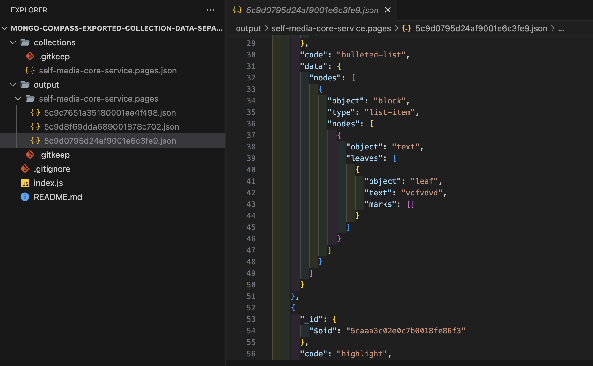

# Mongo compass exported collection data separator

## Why

Sometimes we're doing data migration and want to diff the collection before and after, but the file is too large to be open for editor.

## Usage

1. Use MongoDB Compass to export the target collection into `./collections`
2. run
   ```
   node index.js <readLineLimit?: int>
   ```
3. Separated records will be placed in `./output/<collection name>/<oid>.json`
4. Do the diff you want

## Demo


